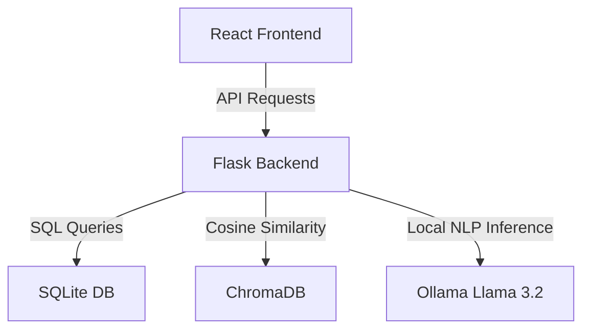

# AuraPlan – AI-Powered Productivity Workspace

AuraPlan is an offline-first, intelligent productivity workspace that merges standard task management, note-taking, and event reminders with a conversational AI assistant named **Aura**. Running entirely on a local Large Language Model (LLM) and vector database, AuraPlan delivers full privacy, latency-free semantic search, and stateful multi-turn agent interactions.

The application features a modern web dashboard with categorizations, priority tags, and a dynamically generated daily schedule visualizer. By running all processing locally, AuraPlan ensures personal schedule details and thoughts never leave the user's device.

---

## Project Overview

AuraPlan combines task management, notes, reminders, semantic search, and an AI assistant into a unified workspace. Users can record and categorize tasks naturally via input bars or engage in a stateful chat sidebar to query, modify, or schedule items. 

The workspace leverages a hybrid database layer: SQLite stores relational item schemas, while ChromaDB indexes task descriptions as high-dimensional vector embeddings. This allows users to find tasks conceptually rather than relying on exact keyword matching.

---

## Problem Statement

Traditional productivity tools suffer from high input friction, requiring users to fill out complex forms, select calendar dates from dropdowns, and manually filter categories. Natural language interfaces solve this by enabling users to interact using colloquial speech or text (e.g., *"remind me to call Mom tomorrow at 5pm"*), drastically improving productivity.

However, existing AI-assisted productivity tools rely heavily on cloud-hosted APIs. Sending personal notes, daily schedules, and project deadlines to cloud servers introduces significant data privacy and security risks. AuraPlan addresses this issue by running open-source LLMs and vector search models locally on the host machine, providing a completely private, offline-capable productivity ecosystem.

---

##  Key Features

*   **AI Assistant (Aura)**: An interactive, stateful chat panel that processes user commands, manages confirmations, and handles multi-turn clarification dialogs.
*   **Natural Language Task Creation**: Automatic parsing of unstructured text commands to extract titles, dates, priorities, categories, and tags using local LLM inference.
*   **Notes Management**: Seamless capturing, viewing, and organizing of personal logs and conceptual reminders
*   **Reminders**: Time-based scheduling with automated relative date parsing (e.g. "today", "tomorrow") and priority tags.
*   **Semantic Search with ChromaDB**: Concept-based task retrieval (e.g., searching for *"health"* returns *"Gym prep"* or *"Dentist appointment"*) rather than simple keyword matches.
*   **Visual Day Planner**: Programmatically compiles daily scheduled tasks and priorities into a color-coded graphic daily timeline using an offline image rendering engine.
*   **Calendar & Email Sync**: Ingestion system designed to fetch simulated external calendar events and extract key tasks from emails.
*   **Local LLM Processing**: Secure, private entity extraction and command processing powered by a local Ollama server running Llama 3.2.
*   **Responsive Dashboard**: Glassmorphic, highly aesthetic dark-mode layout with status cards, filter tabs, and quick-creation fields.

---

## System Architecture

AuraPlan uses a decoupled client-server architecture running entirely on `localhost`.



*   **React Frontend**: Single-page application built on React 19, managing view routing, interactive stateful dialogs, and real-time refreshes.
*   **Flask Backend**: Python REST API that coordinates endpoint routing, calendar/email synchronization, and daily schedule image generation.
*   **Database & Search**: SQLite handles structured relational schema storage, while ChromaDB manages persistent vector indexing for semantic matching.
*   **LLM Inference**: Ollama processes natural language parsing requests locally using the Llama 3.2 model.

---

## Technology Stack

| Layer | Technology | Details |
| :--- | :--- | :--- |
| **Frontend** | React 19, React Router v7 | Component UI framework and client routing |
| **Backend** | Flask 3.0.3 | RESTful backend API endpoints |
| **Database** | SQLite3 | Serverless local relational database |
| **Vector Database** | ChromaDB 0.4.22 | High-performance embedding index |
| **AI / LLM** | Ollama (Llama 3.2) | Private localized NLP parsing and assistant chat |
| **Visualization** | Pillow (PIL) | Dynamic image generation for daily planner views |
| **Development Tools**| Vite 7, Axios, npm, dotenv | Build tooling, HTTP requests, configuration |

---

## Project Structure

```text
AuraPlan/
├── backend/
│   ├── app.py                      # Flask API endpoints and controllers
│   ├── database.py                 # SQLite relational CRUD operations
│   ├── vector_store.py             # ChromaDB vector index wrapper
│   ├── start_backend.py            # Startup bootstrapper with pre-flight checks
│   ├── ingestion/                  # Calendar/Email data sync pipelines
│   ├── llm_extraction/             # System prompts and Ollama connection service
│   ├── processing/                 # Intent parsing, sync rules, and action utilities
│   └── visualizer/                 # Pillow day view planner generator
└── frontend/
    ├── vite.config.js              # Vite config with backend API proxy
    └── src/
        ├── AppRouter.jsx           # Views routing definition
        ├── components/             # Layout panels (Sidebar, AuraChatPanel)
        ├── pages/                  # Main views (Dashboard, VisualDayPage)
        └── services/               # Axios API communication scripts
```

---

## AI Workflow

1.  **User Query**: The user inputs a text request (e.g. *"Complete my DBMS assignment"* or *"What meetings do I have?"*).
2.  **Intent Extraction**: The request is parsed by a local Llama 3.2 model via Ollama to determine the intent and extract key entities.
3.  **Action Processing**: The parsed command is validated, matching candidates are fetched, and safety checks are run.
4.  **Database Operations**: SQLite processes SQL queries to apply modifications (creates, updates, completions, deletions).
5.  **Semantic Search**: Query embeddings are matched against ChromaDB records using cosine similarity to retrieve conceptual context.
6.  **Response Generation**: Aura combines the relational data, vector matches, and chat history to formulate a private response.

---

## Screenshots

*   **Landing Page**:
    *`[Placeholder: Landing Page Illustration showing hero section and features overview]`*
*   **Dashboard View**:
    *`[Placeholder: Dashboard interface with Overdue, Today, and No-Date categories]`*
*   **Aura Chat Assistant**:
    *`[Placeholder: Conversation sidebar showing action confirmation cards and disambiguation buttons]`*
*   **Semantic Search**:
    *`[Placeholder: Search page listing conceptually retrieved items with relevance scores]`*
*   **Visual Day Planner**:
    *`[Placeholder: Pillow-rendered timeline chart displaying daily agenda blocks]`*

---

##  Installation & Setup

### Prerequisites
*   Python 3.10+
*   Node.js 18+ and npm
*   [Ollama Engine](https://ollama.ai)

### Ollama Setup
1.  Start the Ollama daemon:
    ```bash
    ollama serve
    ```
2.  Download the required LLM model:
    ```bash
    ollama pull llama3.2
    ```

### Backend Setup
1.  Navigate to the backend folder and create a virtual environment:
    ```bash
    cd backend
    python -m venv venv
    ```
2.  Activate the environment:
    *   **Windows**: `.\venv\Scripts\activate`
    *   **macOS/Linux**: `source venv/bin/activate`
3.  Install dependencies:
    ```bash
    pip install -r requirements.txt
    ```
4.  Launch the backend server:
    ```bash
    python start_backend.py
    ```

### Frontend Setup & Launch
1.  Navigate to the frontend folder and install packages:
    ```bash
    cd frontend
    npm install
    ```
2.  Start the Vite server:
    ```bash
    npm run dev
    ```
3.  Open `http://localhost:5173` in your browser.

---

## Deployment Note

AuraPlan currently uses Ollama with Llama 3.2 for local AI inference, enabling offline operation and enhanced privacy.

The architecture is designed to be provider-agnostic and can be adapted to cloud-based AI providers such as Groq or OpenAI with minimal backend modifications.

---

## Future Enhancements

*   **Multi-user Support**: Add user authentication (e.g. JWT) and individual workspaces.
*   **Gmail & Google Calendar Sync**: Replace mock data integrations with direct OAuth pipelines to external providers.
*   **Voice Assistant**: Enable hands-free command capturing using speech-to-text.
*   **Multi-LLM Routing**: Route simple tasks to fast local models and complex queries to larger cloud models.
*   **Analytics Dashboard**: Build graphical stats panels displaying task completion trends and categories.

---

##  Learning Outcomes

*   **Stateful Conversation Flows**: Constructed a custom conversation orchestrator using state stores to manage multi-turn validation, cancellation options, and disambiguation blocks.
*   **Offline AI Pipelines**: Integrated local LLMs and vector indexes, learning how to configure context windows and embeddings metrics.
*   **Hybrid Data Syncing**: Coordinated synchronous operations between SQLite database transactions and ChromaDB vector updates.
*   **Optimistic Client Updates**: Implemented reactive event triggers in React to ensure the UI updates instantly when backend AI agents complete changes.

---

